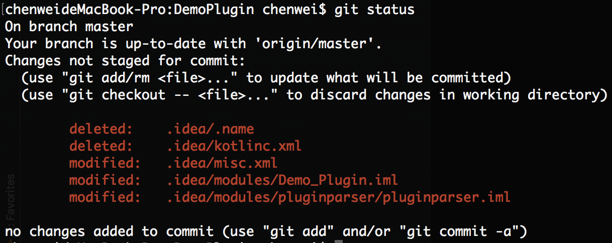

Import project and build
========================

# Import project

## clone the repository

`git clone https://github.com/weichen2046/IntellijPluginDevDemo.git`

## Import as gradle project

  - Open Intellij IDEA and choose import project

    

  - Config import settings as following picture

    

    > - You can ignore `Gradle JVM` currently.
    > - Overrite exist `.idea` file if needed
    >
    >   

  - Remove not imported module

    

  - Move file `pluginparser.iml` to directory `.idea/modules` and delete directory `.idea/modules/pluginparser`

    After import successfully, module hierarchy like this picture:

    

    After move file `pluginparser.iml`, module hierarchy like this:

    

  - Restore files after import

    Some file in vcs changes after import:

    

    Just restore them use command `git checkout .`.

  You have a clean project now.

# Build plugin

Open the Gradle tool window, you will get tasks to build and run plugins.

   - Run `build` or `buildPlugin` task to build plugin
   - Run `runIde` task to start sandbox IDEA to test and debug plugin