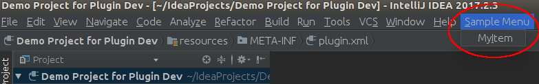
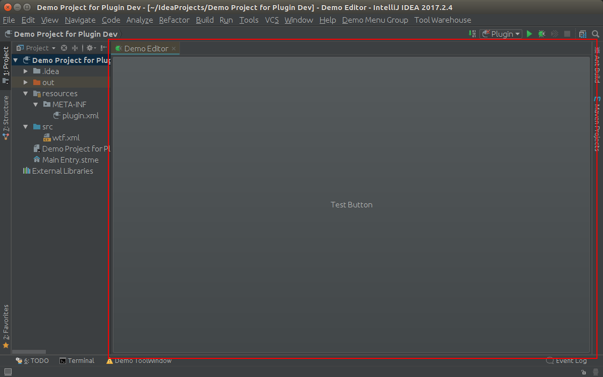
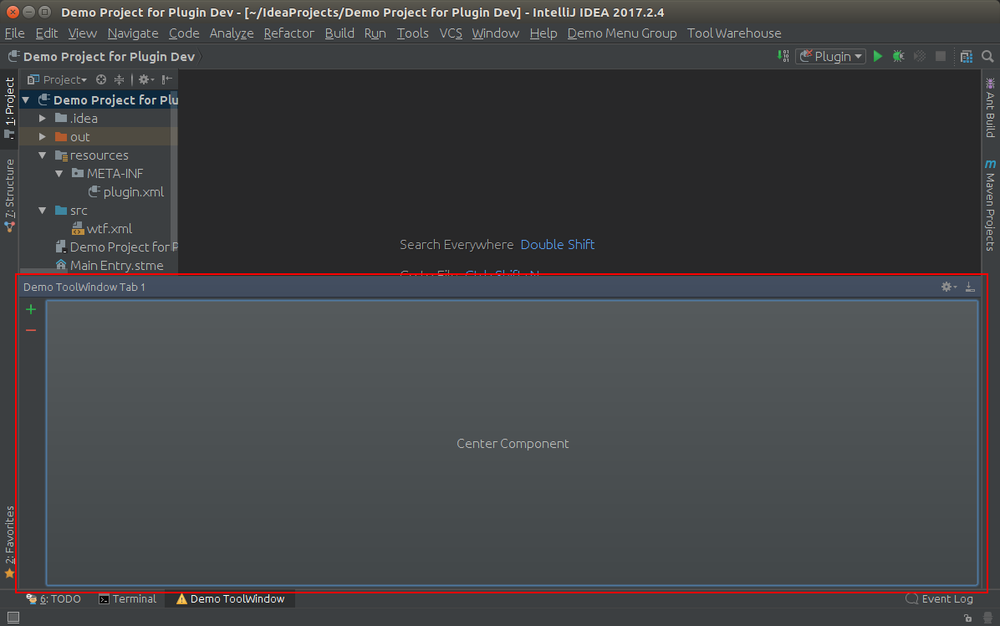
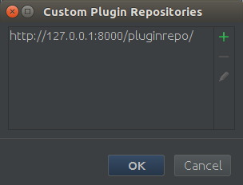
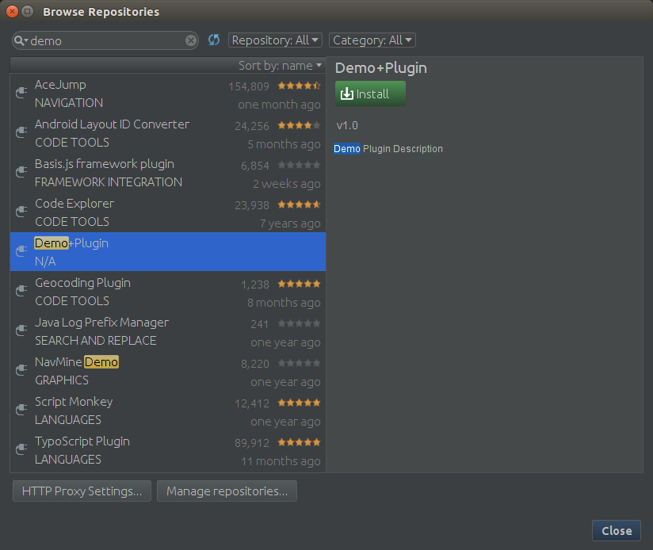

# IntellijPluginDevDemo

Intellij IDEA plugin demos with a simple enterprise repository.

## Requirements

### gradle config

Add a property named `idea_local_path` to your `~/.gradle/gradle.properties` file. The value of this property is the absolute path of local IDEA home directory. This path is used to config IDEA sandbox to avoid download IDEA zip file from remote site to save your time.

```
// ~/.gradle/gradle.properties
idea_local_path=/path/to/idea-IC-172.xxxx.xx
```

## Current demos

- [Action Demo](src/main/java/com/spreadst/devtools/demos/action/MyActionClass.java)

  ```
  <actions>
    <!-- Add your actions here -->
    <group id="MyPlugin.SampleMenu" text="_Sample Menu" description="Sample menu">
      <add-to-group group-id="MainMenu" anchor="last"  />
      <!-- icon of action should be placed in a top-level package called icons -->
      <action id="MyPlugin.MyAction" class="com.spreadst.devtools.demos.action.MyActionClass" text="My_Item"
              description="Description of the action item" icon="Icons.AndroidRobot"/>
      <action id="MyPlugin.OpenMainEntry" class="com.spreadst.devtools.android.editors.mainentry.OpenMainEntryAction"
              text="_Main Entry" description="Open tools main entry" icon="Icons.MainEntry"/>
    </group>
  </actions>
  ```

  

- [Custom Editor Demo](src/main/java/com/spreadst/devtools/editors/mainentry/)

  

- [Tool Window Demo](src/main/java/com/spreadst/devtools/demos/toolwindow)

  

## Enterprise Repository

### Requirements

  - Python 2.7.10
  - Virtualenv 15.1.0
  - Django 1.11.4
  - Node 6.11.3
  - yarn 1.0.1

### Initialize environment

#### Background

```
cd enterprise-repo
virtualenv env
source env/bin/activate
pip install Django==1.11.4
pip install djangorestframework

cd enterprepo
python manage.py migrate
```

> Note:
>
> - only initialize once.
> - previous global installed  Django need [uninstall][install django] before install Django in current virtual python environment
> - no space allowed in path when install Django or it will fail
>
> Consult [virtualenv][virtualenv] for more information.

#### Frontend

```
cd enterprise-repo
cd frontend
yarn install
./deploy.sh
```

### Start repository server

#### Build frontend resources

```
cd enterprise-repo/frontend
./deploy.sh
```

#### Run test server

```
cd enterprise-repo
source env/bin/activate
cd enterprepo
python manage.py runserver
```

> Note:
>
> - no need `source env/bin/activate` if you already activate the virtual environment.
> - you can navigate to `http://127.0.0.1:8000` after start the test server.

### Add custom repository

[How to add custom repository?][add custom repository]

By default you should use "http://127.0.0.1:8000/pluginrepo/" as custom repository url.





<!-- Add links here -->
[virtualenv]: https://virtualenv.pypa.io/en/stable/
[install django]: https://docs.djangoproject.com/en/1.11/topics/install/
[add custom repository]: https://www.jetbrains.com/help/idea/managing-enterprise-plugin-repositories.html#add_plugin_repos
