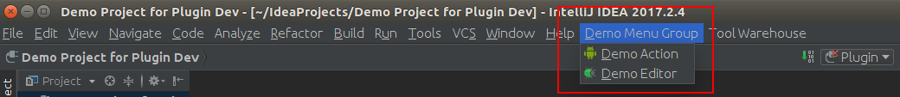

# IntellijPluginDevDemo

Intellij IDEA plugin development demos.

## Current Supports

- [Action Demo](src/com/spreadst/devtools/demos/action/MyActionClass.java)

  ```
  <actions>
    <!-- Add your actions here -->
    <group id="MyPlugin.SampleMenu" text="_Sample Menu" description="Sample menu">
      <add-to-group group-id="MainMenu" anchor="last"  />
      <!-- icon of action should be placed in a top-level package called icons -->
      <action id="MyPlugin.MyAction" class="com.spreadst.devtools.demos.action.MyActionClass" text="My_Item"
              description="Description of the action item" icon="Icons.AndroidRobot"/>
      <action id="MyPlugin.OpenMainEntry" class="com.spreadst.devtools.android.editors.mainentry.OpenMainEntryAction"
              text="_Main Entry" description="Open tools main entry" icon="Icons.MainEntry"/>
    </group>
  </actions>
  ```

  

- [Custom Editor Demo](src/com/spreadst/devtools/android/editors/mainentry/)

## Enterprise Repository

### Initialize environment

```
cd enterprise-repo
virtualenv env
source env/bin/activate
pip install Django==1.11.4

python manage.py migrate
```

> Note:
>
> - previous global installed  Django need [uninstall][install django] before install Django in current virtual python environment
> - no space allowed in path when install Django or it will fail
>
> More information about [virtualenv][virtualenv].

### Start repository server

```
cd enterprise-repo
source env/bin/activate
cd enterprepo
python manage.py runserver
```

### Add custom repository

[How to add custom repository?][add custom repository]

By default you should use "http://127.0.0.1:8000/pluginrepo/" as custom repository url.


<!-- Add links here -->
[virtualenv]: https://virtualenv.pypa.io/en/stable/
[install django]: https://docs.djangoproject.com/en/1.11/topics/install/
[add custom repository]: https://www.jetbrains.com/help/idea/managing-enterprise-plugin-repositories.html#add_plugin_repos
